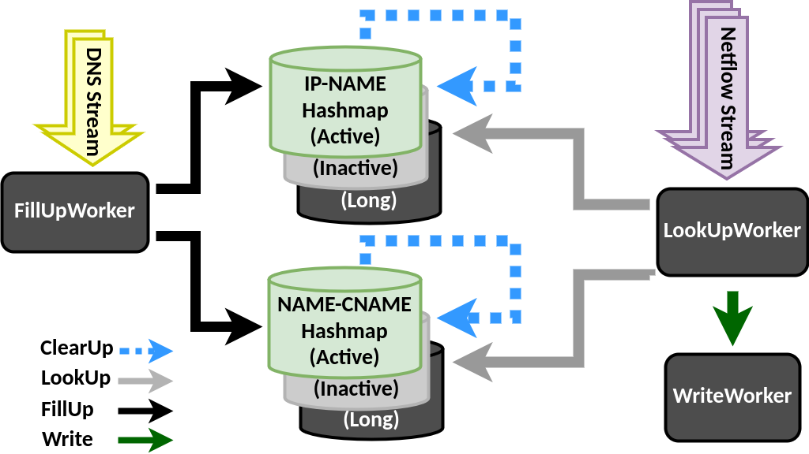

## Correlation Engine:

### How the Correlation Engine Works:

The goal is to be able to categorize source of the traffic by their service, e.g. to understand what fraction of the traffic is originated by Netflix, Amazon Prime, Disney Plus, etc.
To realize this, we look for the srcIP of the Netflow records in the answer section of the A/AAAA DNS records to find the name it corresponds to.
Then looking at the CNAME records, we search for that name to find the CNAME it corresponds to. 
The results from this correlation is then correlated with BGP information to find the actual source ASes, handover ASes, next-hop ASes of each service. 
To perform the DNS-Netflow correlation, DNS and Netflow processings take place in parallel. 
To perform the DNS-Netflow correlation, As Figure 1 shows, the DNS streams are received by FillUp workers. 
These workers analyse the DNS records and fill up a shared internal storage with the DNS records. 
At the same time, the Netflow streams are received by the LookUp workers. 
These workers look for the source of the traffic in the shared internal storage, i.e. shared hashmaps.
Then the result of this lookup is written onto the disk by the Write workers.
For each of these functions, there is a job queue and multiple instances (or workers) of these functions work together to be able to keep up with the streams speed. 
Since multiple instances of the same function will try to access a shared data structure simultaneously, we can shard the data and distribute them to different splits to then isolate each split as much as possible. 

##### DNS Processing
1. DNS Streams are received by separate threads.
2. The DNS records go through a filter to check if they are valid DNS responses.
3. Valid DNS responses will be added to a queue, namely, FillUp Queue, to be then processed by the FillUp workers.
4. Each FillUp worker picks a DNS response from the FillUp Queue and if it is an A/AAAA record, labels it based on the IP address.
5. The FillUp worker then puts the DNS response in either of
the two kinds of hashmaps:
  - IP-NAME hashmap: Maps the answer section, i.e. the IP address found in an A/AAAA response to the queried domain name. 
There are NUM_SPLIT of these hashmaps. 
In our case, NUM_SPLIT is 10. An A/AAAA response whose IP gets the label n from Step 4, goes to IP-NAMEn.
  - NAME-CNAME hashmap: Maps the answer section, i.e. the domain name, to the queried canonical domain name for CNAME records.
There are three of each of the above types of hashmaps: Active, Inactive, and Long.
If the TTL of the DNS records is longer than a certain threshold, the record is stored in the Long hashmap. Otherwise, it is stored in the Active hashmap.
6. The FillUp worker keeps track of the timestamp in each DNS record. 
If AClearUpInterval seconds has passed, it copies the IP-NAMEactive contents to the IP-NAMEbackup and clears
the IP-NAMEactive . 
If CClearUpInterval seconds has passed, it copies the NAME-CNAMEactive contents to the NAME-CNAMEbackup and clears the NAME-CNAMEactive.

##### Netflow Processing
1. Netflow Streams are received by separate threads.
2. The Netflow records go through a filter to check if they are
valid Netflow records.
3. The valid Netflow records are added to the LookUp Queue
to be processed by LookUp workers.
4. Each LookUp worker picks a Netflow record from the LookUp
Queue and labels it based on the srcIP field (label or hashmapIndex = n).
5. The LookUp worker looks for the srcIP in the IP-NAMEactive n
hashmap. If nothing is found, it looks into the Backup hashmap,
and next into the Long hashmap. If a Name is found, the
search continues onto the next step. Otherwise, the search
finishes here for that srcIP (result = NULL).
6. The search will be continued in the NAME-CNAMEactive n
hashmap to find the CNAME for that Name. If a CName
is found, the search continues onto the next step. Other-
wise, the search continues in the Backup and then the Long
hashmap. If nothing is found, the search finishes here for
that Name (result = Name).
7. The search in the NAME-CNAME mapping continues until
no further CNAME is found or a pre-defined loop limit is
reached (result = CName).
8. The result along with the original netflow is then passed to
the Write Queue to be written in the output file by Write-
Workers.




Figure 1. Correlation Engine Architecture

### 1. How to Run the Correlation Engine:

0. If you want to use an already compiled binary, jump to Step 4. 
1. Follow the instructions here to install Go: https://go.dev/doc/install
2. Prepare the go project:
```
$ cd gocorrelation
$ go mod init gocorrelation
```
3. Generate the Binary file:
```
$ go build
```
4. Prepare the configurations as a JSON file. Look at [this config file](https://github.com/maganiss/FlowDNS/-/blob/master/go-conf.json).
The configuration file requires the following values:

| Configuration Value | Type | Description
| - | - | - 
| NumSplit | Int | Number of splits the data will be partitioned to in order to reduce locks. 
| NumCols | Int | Number of columns in the Netflow records.
| RouterIndex | Int | The index (starting from 0) of PEER_SRC_IP field in the Netflow records.
| InifaceIndex | Int | The index (starting from 0) of IN_IFACE field in the Netflow records.
| SrcipIndex | Int | The index (starting from 0) of SRC_IP field in the Netflow records.
| DstipIndex | Int | The index (starting from 0) of DST_IP field in the Netflow records.
| TimestampIndex | Int | The index (starting from 0) of TIMESTAMP_END field in the Netflow records.
| PacketsIndex | Int | The index (starting from 0) of PACKETS field in the Netflow records.
| BytesIndex | Int | The index (starting from 0) of BYTES field in the Netflow records.
| DNSPipes | Array of Strings | Full path to the all DNS pipes
| NetflowPipes | Array of Strings | Full path to all the Netflow pipes.
| OutPath | String | The directory path to write the results into.
| CNAME_ClearUpInterval | Int | Time (in seconds) after which the CNAME tables clear up.
| A_ClearUpInterval | Int | Time (in seconds) after which the A/AAAA tables clear up.
| CDNs | Array of Strings | Substrings to look for in the domain name to prioritize them.
| NumFillUpWorkers | Int | Number of goroutines to fill up the DNS tables.
| NumLookUpWorkers | Int | Number of goroutines to look up the srcips from the Netflow records.
| NumWriteWorkers | Int | Number of goroutines to write the results onto the disk.


5. Run the correlation engine:

```
./gocorrelation go-conf.json

```
The format of the files written to `OutPath` is the following:
`ROUTER, INIFACE, SRCIP, DSTIP, TIMESTAMP, PACKETS, BYTES, MULTIDOMAIN,DOMAINS`

